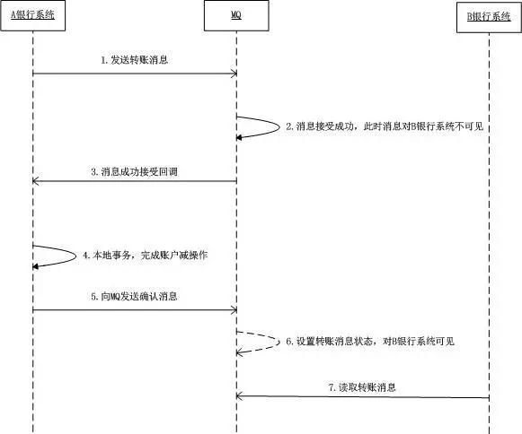

# rocketmq学习

## 常用命令

### 启动nameserver命令

~~~ cmd
start mqnamesrv.cmd
~~~

### 启动broker

~~~ cmd
start mqbroker.cmd -n 127.0.0.1:9876 autoCreateTopicEnable=true
~~~

## 配置

application.properties

~~~
rocketmq.client.name=vehicleProducer
rocketmq.namesrv.addr=localhost:9876
~~~

## 使用

### 同步发送

~~~java
 SendResult sendResult = producer.send(msg);
 System.out.printf("%s%n", sendResult);
~~~

### 异步发送

通过callback实现

但是回调函数尚未结束，producer结束的话会报错。

~~~java
  producer.send(msg, new SendCallback() {
                    @Override
                    public void onSuccess(SendResult sendResult) {
                        System.out.printf("%-10d OK %s %n", index,
                            sendResult.getMsgId());
                    }
                    @Override
                    public void onException(Throwable e) {
                        System.out.printf("%-10d Exception %s %n", index, e);
                        e.printStackTrace();
                    }
                });
~~~

### 单向传输

单向传输通常用于可达要求不高的消息，如日志。

~~~java
producer.sendOneway(msg);
~~~


### 基本使用

consumer

~~~java
@Bean
public DefaultMQPushConsumer getRocketMQConsumer( MessageListenerConcurrently messageListener) {
    DefaultMQPushConsumer consumer = new DefaultMQPushConsumer(groupName);
    consumer.setConsumeThreadMin(consumeThreadMin);
    consumer.setConsumeThreadMax(consumeThreadMax);
    consumer.setVipChannelEnabled(false);
    //我们自己实现的监听类
    consumer.registerMessageListener(messageListener);
    try {
        consumer.subscribe(topic, tag);
        consumer.start();
        log.info("consume is start ,groupName:{},topic:{}", groupName, topic);
    } catch (MQClientException e) {
        log.error("consume start error");
        e.printStackTrace();
    }
    return consumer;
}
~~~

producer

~~~java
@Bean
public DefaultMQProducer getRocketMQProducer() {
    longAdder.increment();
    DefaultMQProducer producer = new DefaultMQProducer(groupName+longAdder);
    producer.setMaxMessageSize(maxMessageSize);
    producer.setSendMsgTimeout(sendMsgTimeout);
    producer.setVipChannelEnabled(false);
    try {
    	producer.start();
    	log.info("rocketMQ is start !!groupName : {}", groupName+longAdder);
    } catch (MQClientException e) {
        log.error(String.format("rocketMQ start error,{}", e.getMessage()));
        e.printStackTrace();
    }
    return producer;
}
~~~

### 有序使用

消息并不是全局有序，而是部分有序即当消息都在同一队列时，遵循FIFO原则，所以有序。

单个consumer

通过返回SUCCESS来表示消费成功

但是当前面的消息未消费成功，这次消费即使success也是失败的

```java
consumer.registerMessageListener(new MessageListenerOrderly() {
    AtomicLong consumeTimes = new AtomicLong(0);
    LongAdder successNum=new LongAdder();
    @Override
    public ConsumeOrderlyStatus consumeMessage(List<MessageExt> msgs,
                                               ConsumeOrderlyContext context) {
        context.setAutoCommit(false);
        long v = this.consumeTimes.incrementAndGet();
        System.out.println("atomic_long_value: " + v);
        for (MessageExt msg : msgs) {
            if (msg.getQueueId() == 2)
                System.out.println("2 content:"+new String(msg.getBody()));
        }
        if ((v % 2) == 0) {
            successNum.increment();
            System.out.println(successNum);
            return ConsumeOrderlyStatus.SUCCESS;
        } else if ((v % 3) == 0) {
            return ConsumeOrderlyStatus.ROLLBACK;
        } else if ((v % 5) == 0) {
            return ConsumeOrderlyStatus.COMMIT;
        } else if ((v % 7) == 0) {
            context.setSuspendCurrentQueueTimeMillis(3000);
            return ConsumeOrderlyStatus.SUSPEND_CURRENT_QUEUE_A_MOMENT;
        }
        return ConsumeOrderlyStatus.SUCCESS;

    }
});
```

producer

通过orderid来区分队列

~~~java
for (int i = 0; i < 100; i++) {
    int orderId = i % 10;
    //Create a message instance, specifying topic, tag and message body.
    Message msg = new Message("TopicTest", tags[i % tags.length], "KEY" + i,
    ("Hello RocketMQ " + i).getBytes(RemotingHelper.DEFAULT_CHARSET));
    SendResult sendResult = producer.send(msg, (mqs, msg1, arg) -> {
    Integer id = (Integer) arg;
    int index = id % mqs.size();
    return mqs.get(index);
    }, orderId);

    System.out.printf("%s%n", sendResult);
}
~~~

### 广播使用

consumer

订阅主题的所有消费者都会收到消息

~~~java
consumer.setMessageModel(MessageModel.BROADCASTING);
~~~

### 定时使用

producer

~~~
 message.setDelayTimeLevel(3);
~~~

### 批量使用

producer

注意大小不超过1mb

~~~java
String topic = "BatchTest";
List<Message> messages = new ArrayList<>();
messages.add(new Message(topic, "TagA", "OrderID001", "Hello world 0".getBytes()));
messages.add(new Message(topic, "TagA", "OrderID002", "Hello world 1".getBytes()));
messages.add(new Message(topic, "TagA", "OrderID003", "Hello world 2".getBytes()));
try {
    producer.send(messages);
} catch (Exception e) {
    e.printStackTrace();
    //handle the error
}
//可以通过message.getTopic().length() + message.getBody().length;//获取一个message大小 注意保留日志空间
~~~

### 数据过滤

producer

~~~java
msg.putUserProperty("a", String.valueOf(i));
~~~

consumer

通过类似sql的进行过滤

~~~java
consumer.subscribe("TopicTest", MessageSelector.bySql("a between 0 and 3");
~~~

### 事务消息




事务开始之前先发送消息开始的的时候 接受者不可见

事务结束之后只有成功的时候消费方可见，如果时unknown会超时重试（mq发送回查消息）

事务消息状态有三种 `unknown`，`commit`，`rollback`

producer

```java
TransactionMQProducer producer = new TransactionMQProducer("please_rename_unique_group_name");
// 配置线程池
producer.setExecutorService(executorService);
producer.setTransactionListener(transactionListener);
// 通用配置.....
producer.start();
SendResult sendResult = producer.sendMessageInTransaction(msg, null);
```

实现监听接口

~~~java
public interface TransactionListener {
	// 执行本地事务会返回事务状态
    LocalTransactionState executeLocalTransaction(Message var1, Object var2);
	// 检查事务是否执行成功，当超时时就会执行此方法
    LocalTransactionState checkLocalTransaction(MessageExt var1);
}
~~~

事务流程图

